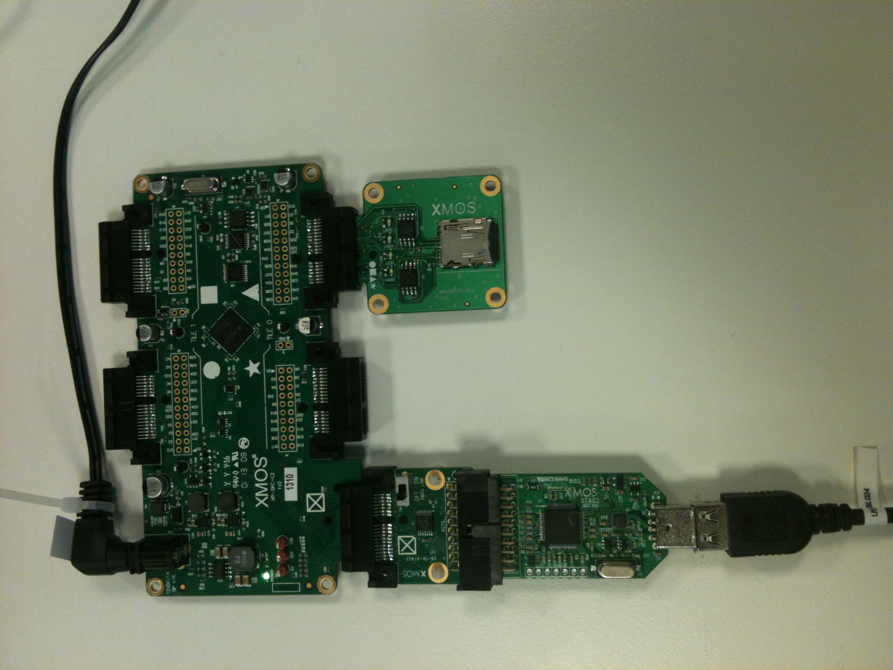

.. _app_sdcard_test_Quickstart:

SD card Demo Quickstart Guide
========================================

sc_sdcard demo : Quick Start Guide
+++++++++++++++++++++++++++++++++++
This application uses XA-SK-FLASH 1V0 Flash slice together with sc_sdcard xSOFTip to 
 - demonstrate read/write files on SD card through SPI interface.
 - showcase some of the key software features of SD card module and FAT filesystem module

In this demonstration we use the following hardware and software:
  1. XP-SKC-L16 sliceKIT L16 core board
  2. xTAG2 and XA-SK-XTAG2 adapter
  3. XA-SK-FLASH 1V0 Flash slice
  4. module_FatFs
  5. module_sdcardSPI
  6. module_spi_master

At the end it prints read/write performances of FAT Filesystem on SD card using SPI interface

Hardware Setup
++++++++++++++

The XP-SKC-L16 sliceKIT core board has four slots with edge connectors: ``SQUARE``, ``CIRCLE``, ``TRIANGLE`` and ``STAR``. 

To setup up the system:

   #. Connect the Flash slice Card to the L16 core board using the connector marked with the ``TRIANGLE``.
   #. Connect the xTAG Adapter to sliceKIT Core board, and connect xTAG-2 to the adapter. 
   #. Connect the xTAG-2 to host PC. Note that the USB cable is not provided with the sliceKIT starter kit.
   #. Set the ``XMOS LINK`` to ``OFF`` on the xTAG Adapter(XA-SK-XTAG2).
   #. Make sure the SD card slot in XA-SK-FLASH slice has a Class-4 SD card in it.
   #. Switch on the power supply to the sliceKIT core board.
	

   :width: 400px
   :align: center

   Hardware Setup for SD card Demo

Import and Build the Application
++++++++++++++++++++++++++++++++

   #. Open xTIMEcomposer Studio and check that it is operating in online mode. Open the edit perspective (Window->Open Perspective->XMOS Edit).
   #. Locate the ``'SD card demo'`` item in the xSOFTip pane on the bottom left of the window and drag it into the Project Explorer window in the xTIMEcomposer Studio. This will also cause the modules on which this application depends to be imported as well. 
   #. Click on the app_sdcard_test item in the Explorer pane then click on the build icon (hammer) in xTIMEcomposer Studio. Check the console window to verify that the application has built successfully.

Run the Application
+++++++++++++++++++

Now that the application has been compiled, the next step is to run it on the sliceKIT core board using the tools to load the application over JTAG (via the xTAG-2 and xTAG Adapter card) into the xCORE multicore microcontroller.

   #. Select the file ``app_sdcard_test.xe`` in the ``app_sdcard_test`` project from the Project Explorer.
   #. Click on the ``Run`` icon (the white arrow in the green circle). 
   #. At the ``Select Device`` dialog select ``XMOS xTAG-2 connect to L1[0..1]`` and click ``OK``.
   #. The application starts executing and reads/writes contents into SD card.
   #. Users can check that read/write performances are printed on the console.

Next Steps
++++++++++

 #. Try altering the size of file to be written to SD card and make sure file sizes during write/read operations are still accurate. You can do so by reducing the size of Buff which is initialized with 40 blocks (each 512 bytes) in file app_sdcard_test.xc.

 #. You can vary the speed of SPI clock and see if that makes any difference. You can do so by changing the second parameter in spi_master_init() function called in disk_initialize() in module_sdcardSPI/src/SDCardHostSPI.xc. 

